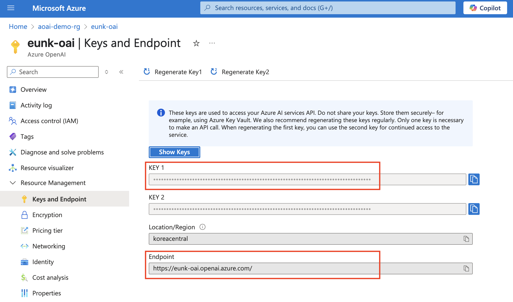
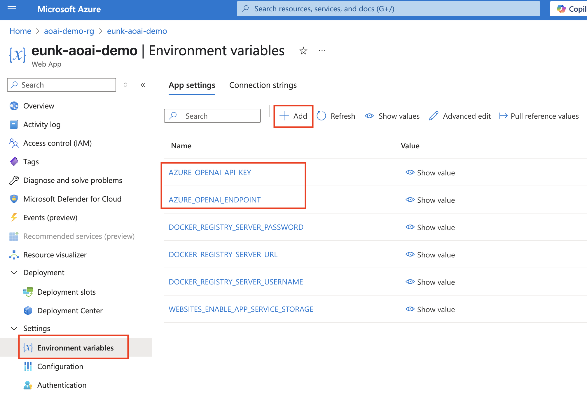

# 2025-aoai-demo

1. 파이선 가상환경 설정
    ```
    # 가상환경 생성
    python -m venv venv

    # 가상환경 활성화
    source venv/bin/activate  # macOS/Linux/WSL
    # 또는
    .\venv\Scripts\activate   # Windows PowerShell
    ```

2. 패키지 설치 
    ```
    pip install -r requirements.txt
    ```

3. Azure Open AI 리소스 생성 후 key와 endpoint 환경변수 설정
.env.example을 참고하여 .env를 생성하고 Azure Open AI에서 발급받은 key값과 endpoint를 입력하세요. 


4. 애플리케이션 실행 
    ```
    streamlint run main.py
    ```

5. 도커 build 및 push
    ```
    docker build --platform linux/amd64 -t <your-docker-repo-name>/aoai-demo-app:latest .
    docker run -p 8501:80 <your-docker-repo-name>/aoai-demo-app:latest
    docker login
    docker push <your-docker-repo-name>/aoai-demo-app:latest
    ```

6. Azure Web App 생성 후 환경변수 설정 
